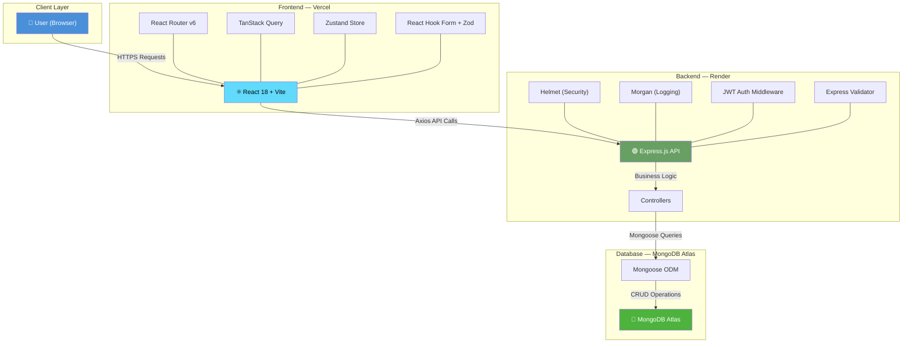
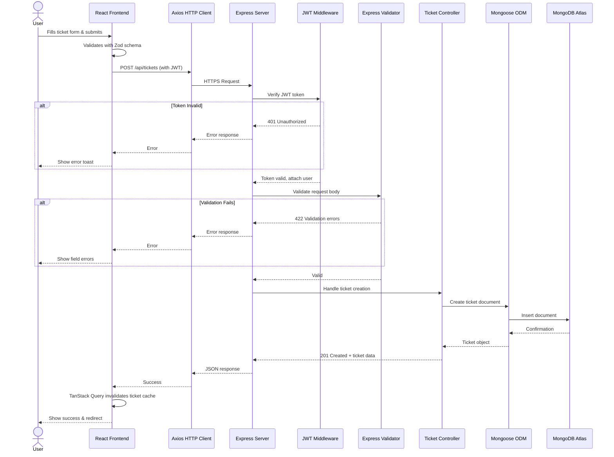
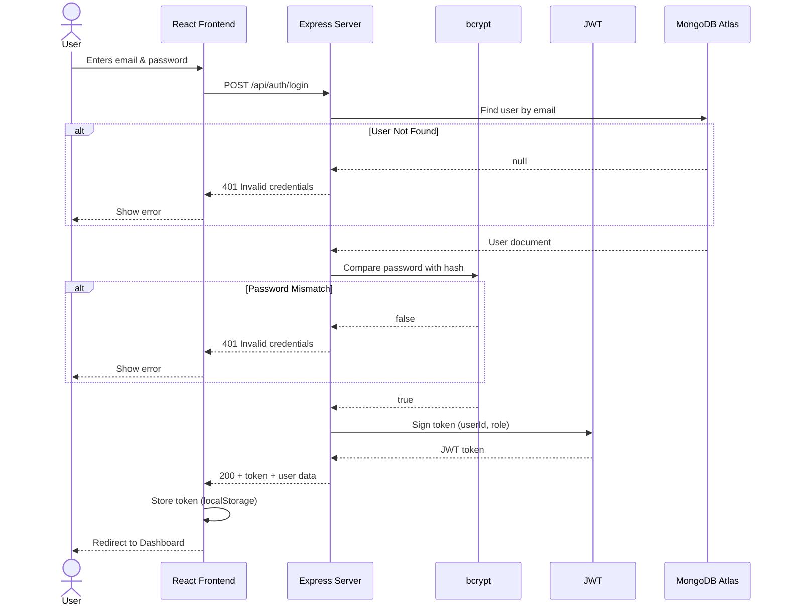
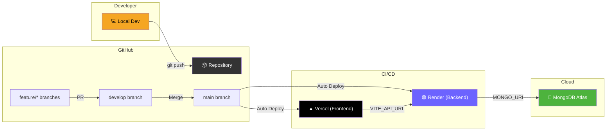

# System Architecture

## High-Level Architecture

```mermaid
graph TD
    subgraph "Client Layer"
        A["👤 User (Browser)"]
    end

    subgraph "Frontend — Vercel"
        B["⚛️ React 18 + Vite"]
        B1["React Router v6"]
        B2["TanStack Query"]
        B3["Zustand Store"]
        B4["React Hook Form + Zod"]
    end

    subgraph "Backend — Render"
        C["🟢 Express.js API"]
        C1["Helmet (Security)"]
        C2["Morgan (Logging)"]
        C3["JWT Auth Middleware"]
        C4["Express Validator"]
        C5["Controllers"]
    end

    subgraph "Database — MongoDB Atlas"
        D["🍃 MongoDB Atlas"]
        D1["Mongoose ODM"]
    end

    A -->|"HTTPS Requests"| B
    B -->|"Axios API Calls"| C
    B1 --- B
    B2 --- B
    B3 --- B
    B4 --- B
    C1 --- C
    C2 --- C
    C3 --- C
    C4 --- C
    C -->|"Business Logic"| C5
    C5 -->|"Mongoose Queries"| D1
    D1 -->|"CRUD Operations"| D

    style A fill:#4A90D9,color:#fff
    style B fill:#61DAFB,color:#000
    style C fill:#68A063,color:#fff
    style D fill:#4DB33D,color:#fff
```

---

## Request Flow — Sequence Diagram

### Ticket Creation Flow

```mermaid
sequenceDiagram
    actor User
    participant React as React Frontend
    participant Axios as Axios HTTP Client
    participant Express as Express Server
    participant Auth as JWT Middleware
    participant Validator as Express Validator
    participant Controller as Ticket Controller
    participant Mongoose as Mongoose ODM
    participant MongoDB as MongoDB Atlas

    User->>React: Fills ticket form & submits
    React->>React: Validates with Zod schema
    React->>Axios: POST /api/tickets (with JWT)
    Axios->>Express: HTTPS Request

    Express->>Auth: Verify JWT token
    alt Token Invalid
        Auth-->>Express: 401 Unauthorized
        Express-->>Axios: Error response
        Axios-->>React: Error
        React-->>User: Show error toast
    end
    Auth-->>Express: Token valid, attach user

    Express->>Validator: Validate request body
    alt Validation Fails
        Validator-->>Express: 422 Validation errors
        Express-->>Axios: Error response
        Axios-->>React: Error
        React-->>User: Show field errors
    end
    Validator-->>Express: Valid

    Express->>Controller: Handle ticket creation
    Controller->>Mongoose: Create ticket document
    Mongoose->>MongoDB: Insert document
    MongoDB-->>Mongoose: Confirmation
    Mongoose-->>Controller: Ticket object
    Controller-->>Express: 201 Created + ticket data
    Express-->>Axios: JSON response
    Axios-->>React: Success
    React->>React: TanStack Query invalidates ticket cache
    React-->>User: Show success & redirect
```

---

## Authentication Flow

```mermaid
sequenceDiagram
    actor User
    participant React as React Frontend
    participant Express as Express Server
    participant bcrypt as bcrypt
    participant JWT as JWT
    participant MongoDB as MongoDB Atlas

    User->>React: Enters email & password
    React->>Express: POST /api/auth/login

    Express->>MongoDB: Find user by email
    alt User Not Found
        MongoDB-->>Express: null
        Express-->>React: 401 Invalid credentials
        React-->>User: Show error
    end
    MongoDB-->>Express: User document

    Express->>bcrypt: Compare password with hash
    alt Password Mismatch
        bcrypt-->>Express: false
        Express-->>React: 401 Invalid credentials
        React-->>User: Show error
    end
    bcrypt-->>Express: true

    Express->>JWT: Sign token (userId, role)
    JWT-->>Express: JWT token
    Express-->>React: 200 + token + user data
    React->>React: Store token (localStorage)
    React-->>User: Redirect to Dashboard
```

---

## Deployment Architecture

```mermaid
graph LR
    subgraph "Developer"
        DEV["💻 Local Dev"]
    end

    subgraph "GitHub"
        GH["📦 Repository"]
        GH1["main branch"]
        GH2["develop branch"]
        GH3["feature/* branches"]
    end

    subgraph "CI/CD"
        V["▲ Vercel (Frontend)"]
        R["🟣 Render (Backend)"]
    end

    subgraph "Cloud"
        DB["🍃 MongoDB Atlas"]
    end

    DEV -->|"git push"| GH
    GH3 -->|"PR"| GH2
    GH2 -->|"Merge"| GH1
    GH1 -->|"Auto Deploy"| V
    GH1 -->|"Auto Deploy"| R
    R -->|"MONGO_URI"| DB
    V -->|"VITE_API_URL"| R

    style DEV fill:#f5a623,color:#000
    style GH fill:#333,color:#fff
    style V fill:#000,color:#fff
    style R fill:#6C63FF,color:#fff
    style DB fill:#4DB33D,color:#fff
```
