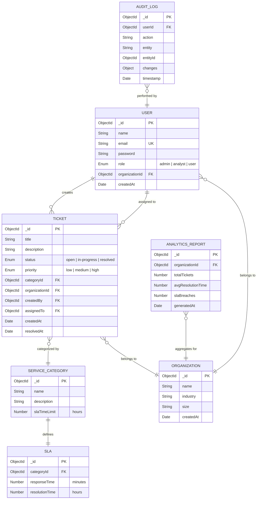

# Entity-Relationship Diagram

## ER Diagram

---

## Relationship Summary

| Relationship                        | Type        | Description                                  |
|-------------------------------------|-------------|----------------------------------------------|
| User → Ticket (creates)            | One-to-Many | A user can create multiple tickets           |
| User → Ticket (assigned)           | One-to-Many | A user can be assigned multiple tickets      |
| User → Organization                | Many-to-One | Multiple users belong to one organization    |
| Ticket → ServiceCategory           | Many-to-One | Multiple tickets share one category          |
| Ticket → Organization              | Many-to-One | Multiple tickets belong to one organization  |
| ServiceCategory → SLA              | One-to-One  | Each category has one SLA definition         |
| AnalyticsReport → Organization     | Many-to-One | Multiple reports for one organization        |
| AuditLog → User                    | Many-to-One | Multiple logs tied to one user               |

---

## Schema Details

### User
| Field          | Type     | Constraints         | Notes                            |
|----------------|----------|---------------------|----------------------------------|
| `_id`          | ObjectId | Primary Key         | Auto-generated                   |
| `name`         | String   | Required            | Full name                        |
| `email`        | String   | Required, Unique    | Used for login                   |
| `password`     | String   | Required            | bcrypt hashed                    |
| `role`         | Enum     | Required            | `admin` / `analyst` / `user`     |
| `organizationId` | ObjectId | Required, FK     | References Organization          |
| `createdAt`    | Date     | Auto                | Mongoose timestamps              |

### Organization
| Field       | Type     | Constraints  | Notes                          |
|-------------|----------|--------------|--------------------------------|
| `_id`       | ObjectId | Primary Key  | Auto-generated                 |
| `name`      | String   | Required     | Company/team name              |
| `industry`  | String   | Optional     | e.g., Healthcare, Finance      |
| `size`      | String   | Optional     | e.g., Small, Medium, Enterprise|
| `createdAt` | Date     | Auto         | Mongoose timestamps            |

### Ticket
| Field           | Type     | Constraints     | Notes                         |
|-----------------|----------|-----------------|-------------------------------|
| `_id`           | ObjectId | Primary Key     | Auto-generated                |
| `title`         | String   | Required        | Brief summary                 |
| `description`   | String   | Required        | Full description              |
| `status`        | Enum     | Required        | `open` / `in-progress` / `resolved` |
| `priority`      | Enum     | Required        | `low` / `medium` / `high`    |
| `categoryId`    | ObjectId | Required, FK    | References ServiceCategory    |
| `organizationId`| ObjectId | Required, FK    | References Organization       |
| `createdBy`     | ObjectId | Required, FK    | References User (creator)     |
| `assignedTo`    | ObjectId | Optional, FK    | References User (analyst)     |
| `createdAt`     | Date     | Auto            | Mongoose timestamps           |
| `resolvedAt`    | Date     | Optional        | Set on resolution             |

### ServiceCategory
| Field          | Type     | Constraints  | Notes                           |
|----------------|----------|--------------|---------------------------------|
| `_id`          | ObjectId | Primary Key  | Auto-generated                  |
| `name`         | String   | Required     | e.g., Network, Hardware, Software|
| `description`  | String   | Optional     | Category description            |
| `slaTimeLimit` | Number   | Required     | Max resolution time in hours    |

### SLA
| Field           | Type     | Constraints  | Notes                        |
|-----------------|----------|--------------|------------------------------|
| `_id`           | ObjectId | Primary Key  | Auto-generated               |
| `categoryId`    | ObjectId | Required, FK | References ServiceCategory   |
| `responseTime`  | Number   | Required     | Max first-response (minutes) |
| `resolutionTime`| Number   | Required     | Max resolution (hours)       |

### AnalyticsReport
| Field             | Type     | Constraints  | Notes                       |
|-------------------|----------|--------------|-----------------------------|
| `_id`             | ObjectId | Primary Key  | Auto-generated              |
| `organizationId`  | ObjectId | Required, FK | References Organization     |
| `totalTickets`    | Number   | Required     | Count in report period      |
| `avgResolutionTime`| Number  | Required     | Average hours to resolve    |
| `slaBreaches`     | Number   | Required     | Count of SLA violations     |
| `generatedAt`     | Date     | Auto         | Report generation timestamp |

### AuditLog
| Field       | Type     | Constraints  | Notes                              |
|-------------|----------|--------------|------------------------------------|
| `_id`       | ObjectId | Primary Key  | Auto-generated                     |
| `userId`    | ObjectId | Required, FK | Who performed the action           |
| `action`    | String   | Required     | e.g., `CREATE`, `UPDATE`, `DELETE` |
| `entity`    | String   | Required     | e.g., `Ticket`, `User`            |
| `entityId`  | ObjectId | Required     | ID of the affected document        |
| `changes`   | Object   | Optional     | Diff of what changed               |
| `timestamp` | Date     | Auto         | When the action occurred           |
