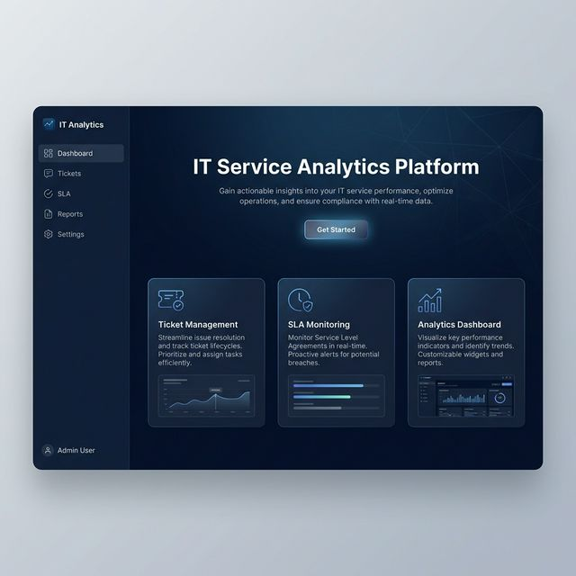
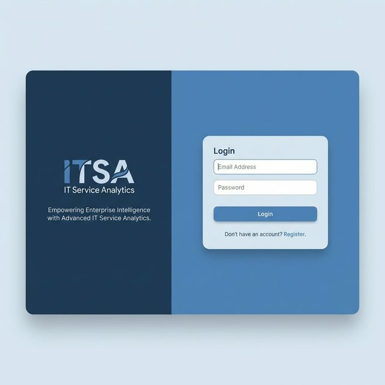
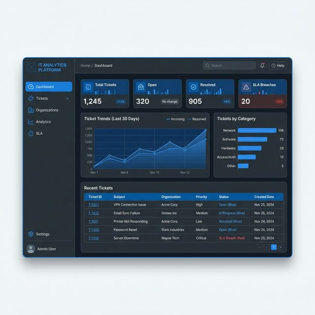
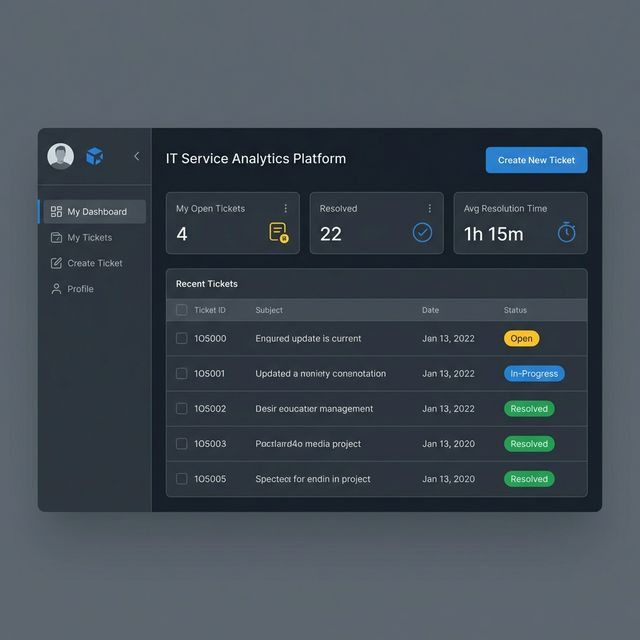
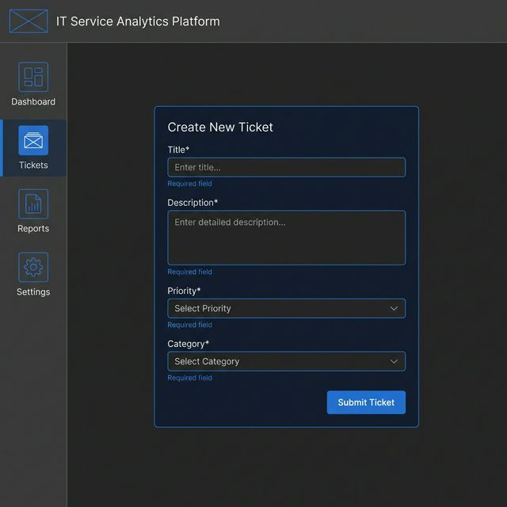
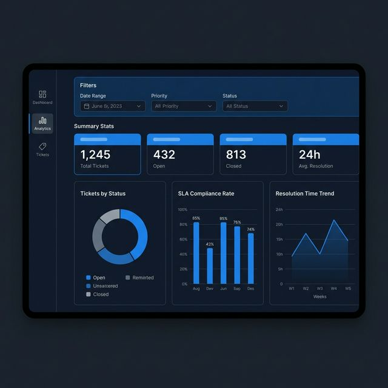
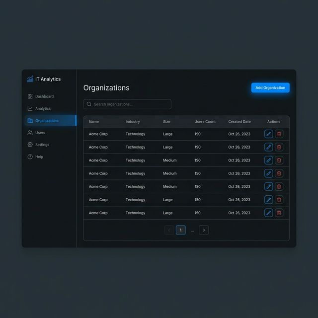

# Wireframes — IT Service Analytics Platform

UI design direction: **Dark blue + navy theme** with a **sidebar layout**, clean enterprise aesthetic.

---

## 1. Landing Page

**Key Elements:**
- Hero section with platform name and value proposition
- 3 feature cards: Ticket Management, SLA Monitoring, Analytics Dashboard
- "Get Started" call-to-action
- Left sidebar navigation

---

## 2. Login / Register

**Key Elements:**
- Split layout — branding on left, form on right
- Email and password fields
- Login button with "Register" link toggle
- Clean, centered card design

---

## 3. Admin Dashboard

**Key Elements:**
- Sidebar: Dashboard, Tickets, Organizations, Analytics, SLA, Settings
- 4 stat cards: Total Tickets, Open, Resolved, SLA Breaches
- Line chart: Ticket trends (last 30 days)
- Bar chart: Tickets by category
- Recent tickets table with status badges

---

## 4. User Dashboard

**Key Elements:**
- Sidebar: My Dashboard, My Tickets, Create Ticket, Profile
- 3 stat cards: My Open Tickets, Resolved, Avg Resolution Time
- Recent tickets list with color-coded status badges
- "Create New Ticket" button

---

## 5. Ticket Creation Form

**Key Elements:**
- Form card with: Title, Description (textarea), Priority (dropdown), Category (dropdown)
- Required field indicators
- Submit button
- Sidebar navigation visible

---

## 6. Ticket Analytics View

**Key Elements:**
- Filter bar: Date range, Priority, Status dropdowns
- Summary stats row
- Donut chart: Tickets by status
- Bar chart: SLA compliance rate
- Line chart: Resolution time trend

---

## 7. Organization Management

**Key Elements:**
- "Add Organization" button
- Search bar
- Data table: Name, Industry, Size, Users Count, Created Date, Actions
- Pagination controls
- Edit/Delete action icons

---

## Design Tokens

| Token         | Value              |
|---------------|--------------------|
| Primary       | `#1A73E8` (Blue)   |
| Background    | `#0F1724` (Navy)   |
| Surface       | `#1E2A3A`          |
| Text Primary  | `#FFFFFF`          |
| Text Secondary| `#94A3B8`          |
| Success       | `#22C55E`          |
| Warning       | `#EAB308`          |
| Error         | `#EF4444`          |
| Font          | Inter / Roboto     |
